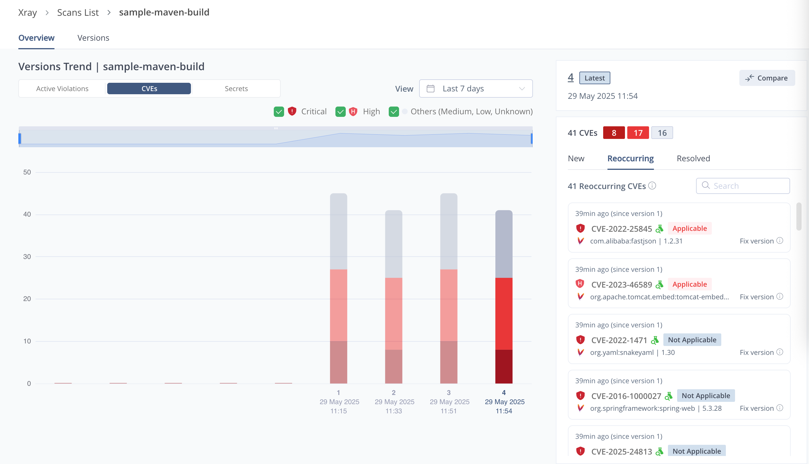

# Conan Sample — JFrog Artifactory + Xray

A simple C++ library built with Conan, uploaded to JFrog Artifactory, and scanned with JFrog Xray.

## Prerequisites

- [Conan 2.x](https://docs.conan.io/2/installation.html) installed (`pip install conan`)
- CMake 3.15+
- C++ compiler (GCC / Clang / MSVC)
- [JFrog CLI](https://jfrog.com/getcli) installed

## Step 1: Configure JFrog CLI

```bash
jf config add artifactory-server \
  --url=https://<your-platform-url> \
  --user=<username> \
  --password=<password>
```

Verify the connection:

```bash
jf rt ping
```

## Step 2: Create a Conan Repository in Artifactory

In the Artifactory UI:

1. Go to **Administration → Repositories → Add Repository → Local**.
2. Select **Conan** as the package type.
3. Set the **Repository Key** to `conan-local`.
4. Click **Save & Finish**.

Also create a **Remote** repository (key: `conan-center-remote`) pointing to `https://center.conan.io/v2/` and a **Virtual** repository (key: `conan-virtual`) that includes both.

## Step 3: Configure Conan to Use Artifactory

Configure the JFrog CLI Conan integration:

```bash
jf conanc
```

This command prompts you for:
- Artifactory server ID (use `artifactory-server`)
- Local repository key: `conan-local`
- Remote/Virtual repository key: `conan-virtual`

The CLI writes a `conan.conf` pointing Conan remotes at your Artifactory instance.

Alternatively, configure manually:

```bash
conan remote add artifactory https://<your-platform-url>/artifactory/api/conan/conan-virtual
conan remote login artifactory <username> --password <password>
```

## Step 4: Build the Package

Install Conan and create a default profile if you haven't already:

```bash
conan profile detect
```

Build and create the Conan package locally:

```bash
cd conan-sample

conan create . \
  --build=missing \
  -pr:a default
```

Expected output: the `hello/1.0.0` package is built, test_package runs, and prints:

```
Hello, JFrog! Built with Conan + JFrog Artifactory.
```

## Step 5: Upload to Artifactory with Build Info

Use JFrog CLI to upload the package and capture build information:

```bash
# Upload the package with build info
jf conan upload hello/1.0.0 \
  --remote=artifactory \
  --build-name=conan-build \
  --build-number=1

# Collect environment variables into build info
jf rt bce conan-build 1

# Publish build info to Artifactory
jf rt bp conan-build 1
```

After publishing, go to **Artifactory UI → Builds** to see `conan-build #1` with all artifact details.



## Step 6: Scan Build with Xray

Trigger an Xray scan on the published build:

```bash
jf rt bs conan-build 1
```

`bs` (build-scan) submits the build to Xray and waits for results. A passing scan looks like:

```
Xray scan completed successfully.
No violations were found.
```

If violations are found, the command exits with a non-zero code and prints a table of CVEs or license issues.

You can also view the results in the **Artifactory UI → Builds → conan-build → Xray** tab.

## Project Structure

```
conan-sample/
├── conanfile.py          # Package recipe
├── CMakeLists.txt        # Build system
├── include/
│   └── hello.h           # Public header
├── src/
│   └── hello.cpp         # Library source
└── test_package/         # Conan test consumer
    ├── conanfile.py
    ├── CMakeLists.txt
    └── src/
        └── main.cpp
```

## CI Example (GitHub Actions)

```yaml
name: Conan CI

on: [push]

jobs:
  build:
    runs-on: ubuntu-latest
    steps:
      - uses: actions/checkout@v4

      - name: Install tools
        run: |
          pip install conan
          curl -fL https://install-cli.jfrog.io | sh

      - name: Configure JFrog CLI
        run: |
          jf config add artifactory-server \
            --url=${{ secrets.JF_URL }} \
            --user=${{ secrets.JF_USER }} \
            --password=${{ secrets.JF_PASSWORD }}

      - name: Detect Conan profile
        run: conan profile detect

      - name: Build package
        run: conan create conan-sample/ --build=missing

      - name: Upload & publish build info
        run: |
          jf conan upload hello/1.0.0 --remote=artifactory \
            --build-name=conan-build --build-number=${{ github.run_number }}
          jf rt bce conan-build ${{ github.run_number }}
          jf rt bp  conan-build ${{ github.run_number }}

      - name: Xray scan
        run: jf rt bs conan-build ${{ github.run_number }}
```
