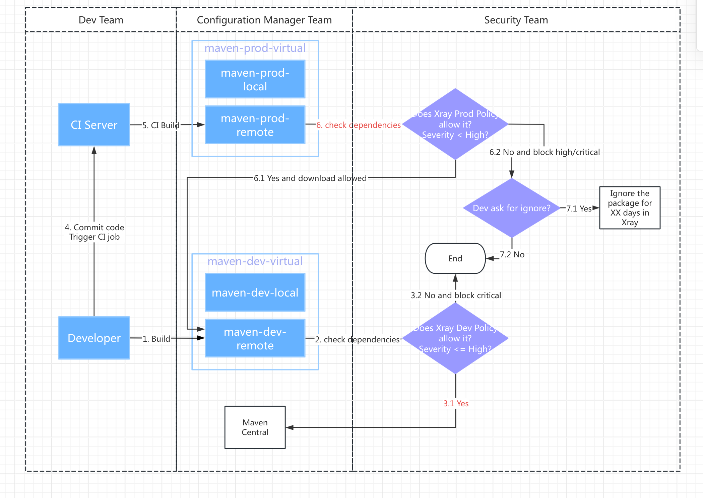

# JFrog OSS Package Management Solution  
**Version 1.0 – Delivered by JFrog Solution Engineering**  
**Document Type:** Full Governance & Architecture Specification  
**Audience:** Dev Team, Configuration Manager Team, Security Team

---

# 1. Overview

This document provides a complete OSS (Open Source Software) package governance solution using  
**JFrog Artifactory** and **JFrog Xray**, based on the customer’s original architecture and workflow diagram.

The goal of this solution is to:

- Ensure strong **production security enforcement**
- Protect **developer productivity**
- Provide a consistent flow for acquiring and approving OSS packages
- Support **CI/CD integration**
- Enable controlled **exception handling (temporary ignore rules)**
- Align with enterprise software supply chain governance best practices

---

# 2. Roles & Responsibilities

## **2.1 Development Team**
- Builds Java/Maven applications  
- Retrieves dependencies from `maven-dev-virtual`
- Commits code and triggers CI
- Requests temporary ignore rules when needed

## **2.2 Configuration Manager Team**
- Manages repository structure and lifecycle
- Controls virtual/local/remote repositories
- Ensures DEV and PROD repositories remain fully separated
- Oversees package flow into CI

## **2.3 Security Team**
- Maintains Xray Dev Policy and Prod Policy  
- Reviews and approves violation exceptions  
- Creates temporary ignore rules  
- Performs compliance and audit reviews

---

# 3. Repository Architecture

The solution uses separate DEV and PROD repository structures to prevent PROD security policies from blocking development.

---

## **3.1 DEV Repository Structure (Used by Developers)**

### Virtual Repository:
```
maven-dev-virtual
```

### Includes:
```
maven-dev-local
maven-dev-remote (proxy to Maven Central)
```

### Policy Behavior:
- Block: Critical  
- Allow: High / Medium / Low  

**Purpose:**  
Enable fast development while giving developers visibility into vulnerabilities without blocking productivity.

---

## **3.2 PROD Repository Structure (Used by CI Builds)**

### Virtual Repository:
```
maven-prod-virtual
```

### Includes:
```
maven-prod-local
maven-prod-remote (controlled remote repository)
```

### Policy Behavior:
- Block: Critical / High  
- Optional: block newly published packages via curation (<14 days old)

**Purpose:**  
Protect production pipelines by preventing risky packages from being approved or deployed.

---

# 4. End-to-End Process Workflow

Below is the complete Maven dependency governance flow, based on the user-provided diagram.

---

## **4.1 Developer Build Process**
1. Developer builds locally using  
   `maven-dev-virtual`
2. Xray Dev Policy evaluates dependencies
3. If Critical → block  
4. If High → allow

---

## **4.2 Code Commit Triggers CI**
5. CI pulls dependencies from  
   `maven-prod-virtual`

---

## **4.3 Xray PROD Policy Check**
6. Xray evaluates:
```
Severity < High ?
```

### If **Yes**:
- Download allowed
- Build continues

### If **No**:
- Block High/Critical vulnerabilities
- If the developer request to use the vulnerable package as an exception, the developer need to send the violations in Xray to the Security Team to review

---

## **4.4 Exception Workflow**
7. Developer asks Security for exception  
8. Security Team evaluates and decides:

### If approved → **Temporary Ignore Rule**
- Targeted to:  
  - Specific CVE  
  - Specific package  
  - Specific version  
  - Specific repository (Prod only)
- Includes **expiration window** (in XXX days)

### If not approved
- Build fails  
- Dependency cannot be used in PROD pipeline  

---

# 5. Detailed Flowcharts


## **5.1  Architecture Flowchart



---

# 6. Xray Policy Recommendations

## **6.1 DEV Policy**
| Severity | Action |
|----------|---------|
| Critical | Block |
| High | Allow |
| Medium | Allow |
| Low | Allow |

Purpose: developer productivity + visibility.

---

## **6.2 PROD Policy**
| Severity | Action |
|----------|---------|
| Critical | Block |
| High | Block |
| Medium | Allow |
| Low | Allow |

Optional Enhancements:
- Block packages published in last X days (default: 14)
- Require SBOM availability
- Require provenance / signature info

---

# 7. Exception Handling Workflow (Ignore Rules)

## **7.1 When to Request an Ignore**
A developer may request an exception when:
- No fixed version is available  
- Business impact requires temporary usage  
- Team agrees to accept temporary risk  

---

## **7.2 Ignore Rule Configuration**

Each ignore rule must specify:

- Package name  
- Version  
- CVE ID  
- Target repository (Prod only)  
- Expiration date (XXX days)  
- Approver (Security team)

---

# 8. Best Practices

## **8.1 Strongly Separate DEV & PROD Remotes**
Avoid dependency contamination from DEV into PROD.

## **8.2 Use Promotion-Based Lifecycle**
```
DEV → TEST → STAGE → PROD
```
Each stage is scanned and approved.

## **8.3 Focus on Precision Scanning**
- Scan builds (not just repos)
- Require SBOM
- Enforce license policies

## **8.4 Do Not Disable Blocking for Convenience**
Use temporary ignore rules instead.

---

# 9. Optional Enhancements (Recommended)

## **9.1 Enable JFrog Curation (SaaS)**
Features:
- Real-time risk filtering  
- Zero-day vulnerability blocking  
- Allow/deny lists  
- Time-based release gating  

## **9.2 SBOM Integration**
Use:
- CycloneDX  
- SPDX  

## **9.3 Advanced DevSecOps Integrations**
- IDE scanning  
- CI pipeline quality gates  
- Git commit scanning using frogbot

---

**End of Document**  
*Prepared by JFrog Solution Engineering Team*
